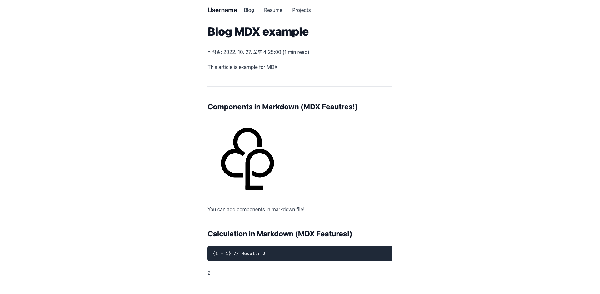
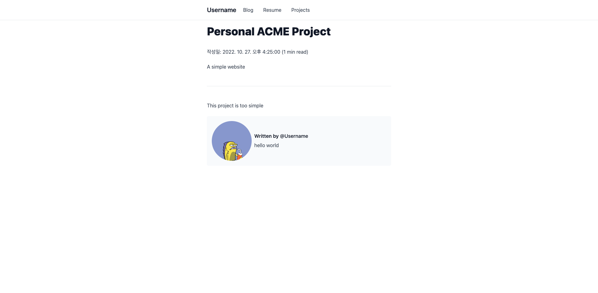

# Blog template with NextJS

## 버전

Node.js: 16.13.0
Yarn: 1.22.18

## 기능

### 1. Markdown/MDX 글 작성

블로그, 이력서, 프로젝트를 Markdown/MDX으로 작성 할 수 있습니다.

### 2. 열람 시간

Markdown/MDX으로 작성된 글을 파싱하여 열람하는데 걸리는 시간으로 변환하여 보여줍니다.

### 3. 동적 OG Image (SSR 전용)

> 이 기능은 SSR에서만 사용 가능합니다.

동적으로 OG Image를 생성합니다.
동적으로 이미지를 생성하고 싶은 페이지가 있다면 `useDyanmicThumbnail` 프롭을 추가하고 `image` 프롭을 HeadMeta에서 아래와 같이 제거하시면 됩니다.

```jsx
import HeadMeta from "~/components/HeadMeta";

const Page = () => {
  return (
    <>
      <HeadMeta
        title="foo"
        description="foo description"
        useDyanmicThumbnail={true} // Change here.
      />
      {/* Content Here... */}
    </>
  );
};
```

### 4. 간편한 빌드 옵션

이 프로젝트는 SSR/SSG 빌드 방식을 지원합니다. 만약 SSG로 빌드를 원할 경우 `yarn static`을 입력하여 빌드하고 `out`폴더를 배포하시면 됩니다.
그리고 SSR로 빌드하고 싶다면 `yarn build`를 입력하시면 됩니다.

### 5. Routes 객체 동적 생성

이 프로젝트에서는 Routes 객체가 담긴 파일을 개발 서버를 시작하거나 빌드할 때 생성할 수 있습니다.
만약 이 프로젝트를 시작했거나 빌드했을 경우 routes.ts라는 파일이 `_generated`라는 폴더에 생성될 것이며 아래와 같은 형식을 하고 있습니다.(포맷팅 적용 되어 있음)

```ts
const routes = [
  { path: "/", name: "Blog" },
  { path: "/projects", name: "Projects" },
  { path: "/resume", name: "Resume" },
];

export default routes;
```

routes.ts 파일은 객체로써 사용될 수 있으며 `components/header/index.tsx`처럼 아무 컴포넌트에서 사용 가능합니다.

```tsx
// ...
import routes from "~/_generated/routes";

const Header = () => {
  return (
    // ...
    <NavList className="flex-col md:flex-row">
      {routes.map((route: Route) => {
        return (
          <NavItem href={route.path} pathname={pathname} key={route.name}>
            {route.name}
          </NavItem>
        );
      })}
    </NavList>
    // ...
  );
};

export default Header;
```

만약 추가하고 싶지 않는 Routes가 있다면 `scripts/routes.ts`에서 변경할 수 있으며 `getPages`라는 함수를 아래와 같이 변경하면 됩니다.

```ts
// ...
pipe(
  getPages(["pages/api/*", "pages/_*", "pages/index.*"]), // 추가하고 싶지 않다면 여기에 내용을 추가하세요.
  generateRouteContent("blog"),
  writeFile("_generated/routes.ts")
);
// ...
```

## 빠른 시작

### 1. 레파지토리 복사

```
git clone https://github.com/ForestLee0513/blog-with-nextjs.git
```

### 2. 패키지 설치

이 탬플릿은 Yarn에 최적화 되어있지만 npm에서도 사용 가능합니다.

```
yarn
```

### 3. 개발서버 시작

```
yarn dev
# open localhost:3000
```

### 4. 작성자 정보 수정

프로젝트의 루트에 위치하고 있는 `bio.ts`를 열고 변경하시면 됩니다. 만약 프로젝트가 성공적으로 클론 되었다면 아래와 같이 표시될 것입니다.

```typescript
const bio = {
  username: "Username",
  description: "hello world",
  url: "https://username.github.io",
  link: {
    Github: "https://github.com/username",
  },
};

export default bio;
```

### 5. 글 작성하기

> 모든 Markdown 파일은 모두 `_data` 폴더에 포함되어 있습니다.
> 각 페이지에 대응하는 frontmatter를 아래에서 확인 후 작성하시면 됩니다.

글은 Markdown과 MDX으로 작성하실 수 있으며 MDX로 작성할 경우 `/components` 폴더에서 컴포넌트를 불러올 수 있습니다.

1. Blog

   ```
   ---
   title: "블로그 글"
   description: "블로그 글 예제입니다."
   date: 2022-10-27 16:25:00
   ---
   ...
   ```

   Markdown과 MDX로 블로그를 작성할 수 있으며 경로는 `_data/blog` 입니다.
   만약 성공적으로 파일을 생성했다면 아래와 같은 결과물이 출력됩니다.

   
   

2. Resume

   ```
   ---
   title: "홍길동의 이력서"
   date: 2022-10-27 16:25:00
   description: "저는 경력 2년차입니다."
   ---
   ...
   ```

   Markdown과 MDX로 이력서를 작성할 수 있으며 경로는 `_data/resume.md` 입니다.
   만약 성공적으로 파일을 생성했다면 아래와 같은 결과물이 출력됩니다.

   

3. Proejcts

   ```
   ---
   title: "개인 프로젝트 1"
   description: "저어어엉말 간단한 웹사이트"
   date: 2022-10-27 16:25:00
   ---
   ...
   ```

   Markdown과 MDX로 이력서를 작성할 수 있으며 경로는 `_data/projects` 입니다.
   만약 성공적으로 파일을 생성했다면 아래와 같은 결과물이 출력됩니다.

   
   

### 6. 배포하기

> 동적 OG Image 기능을 원활하게 활용하기 위해 최상단 URL을 지정해줘야 합니다. 최상단 URL은 `bio.ts`의 `url`와 `package.json`의 `config.url`을 변경하시면 됩니다.

[](https://app.netlify.com/start/deploy?repository=https://github.com/ForestLee0513/blog-with-nextjs) [](https://vercel.com/new/clone?repository-url=https%3A%2F%2Fgithub.com%2FForestLee0513%2Fblog-with-nextjs)

## 커스터마이징

### 스타일 변경

이 탬플릿은 tailwindcss를 사용하고 있습니다. 스타일을 변경하고 싶다면 `/styles`에서 변경할 수 있습니다.

### 동적 OG Image 스타일 변경

`pages/api/og.tsx`에서 동적 OG Image 스타일을 변경 할 수 있습니다.

```jsx
// ...

const OgImageHandler = async (req: NextRequest) => {
  const spoqaRegularData = await spoqaRegular;
  const spoqaBoldData = await spoqaBold;

  const { searchParams } = new URL(req.url);

  const hasTitle = searchParams.has("title");
  const hasDescription = searchParams.has("title");
  const title = hasTitle
    ? searchParams.get("title")?.slice(0, 100)
    : `${bio.username}'s Page`;
  const description = hasDescription
    ? searchParams.get("description")?.slice(0, 100)
    : `${bio.description}`;

  return new ImageResponse(
    (
      <div
        style={{
          display: "flex",
          flexDirection: "column",
          justifyContent: "center",
          alignItems: "center",
          background: "white",
          width: "100%",
          height: "100%",
          padding: "30px",
          fontFamily: "Spoqa Han Sans Neo",
        }}
      >
        <h1
          style={{
            fontSize: 48,
            fontWeight: 600,
          }}
        >
          {title}
        </h1>
        <p style={{ fontWeight: 400 }}>{description}</p>
      </div>
    ),
    {
      width: 1200,
      height: 630,
      fonts: [
        {
          name: "Spoqa Han Sans Neo",
          data: spoqaRegularData,
          weight: 400,
          style: "normal",
        },
        {
          name: "Spoqa Han Sans Neo",
          data: spoqaBoldData,
          weight: 600,
          style: "normal",
        },
      ],
    }
  );
};
```
