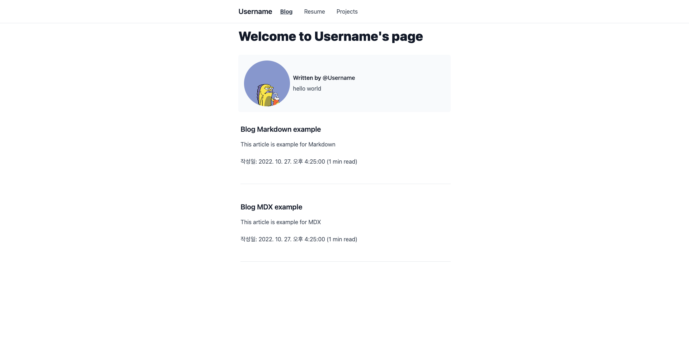
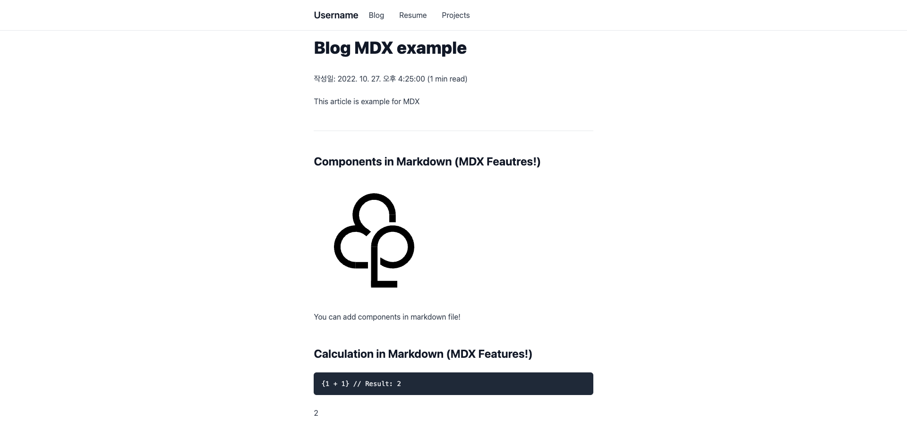
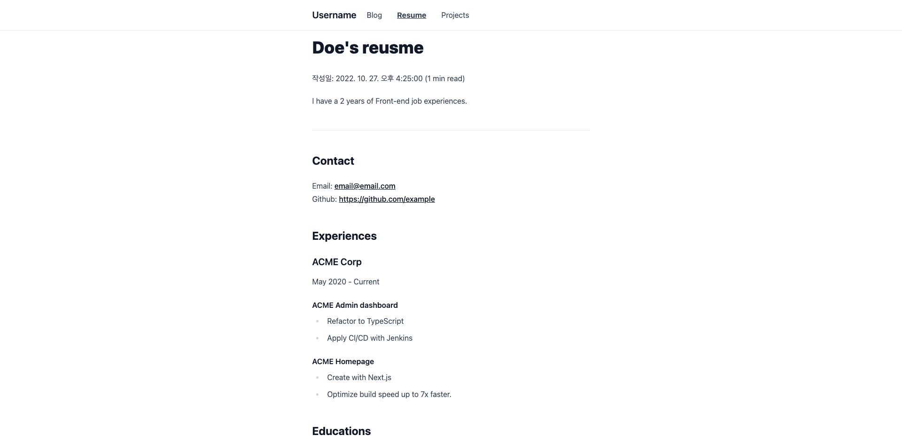
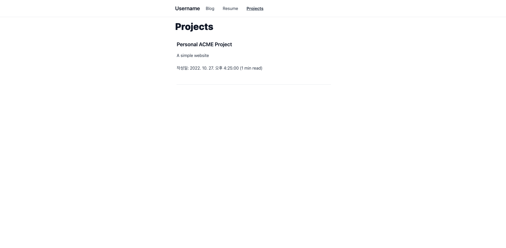
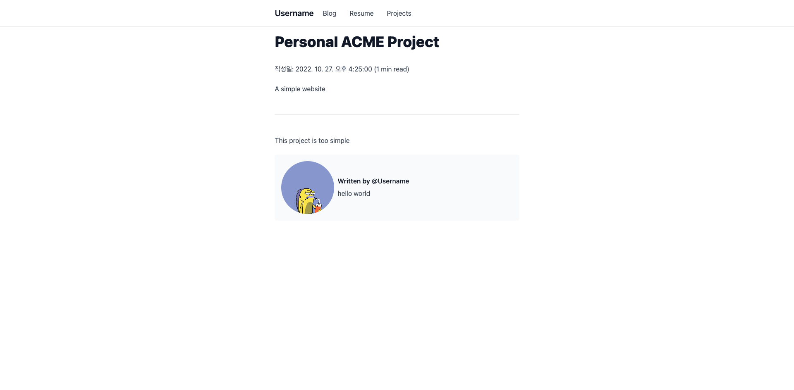

# Blog template with NextJS

## Version requirements

Node.js: 16.13.0
Yarn: 1.22.18

## Quick Start

### 1. Clone this repo

```
git clone https://github.com/ForestLee0513/blog-with-nextjs.git
```

### 2. Install packages

This template is optimized to Yarn, but you can use npm too.

```
yarn
```

### 3. Start development server

```
yarn dev
# open localhost:3000
```

### 4. Edit your bio

Open `author.ts` file in root and change it if you're clone this repo successfully, this file will display like this.

```typescript
const author = {
  username: "Username",
  description: "hello world",
  link: {
    Github: "https://github.com/username",
  },
};

export default author;
```

### 5. Write your things

> All Markdown files are includes in `_data` folder.
> Check a frontmatter of each pages and apply it.

You can write a articles with markdown or MDX and you can import a component of `/components` folder in MDX files.

1. Blog

   ```
   ---
   title: "Blog article"
   description: "A example of blog article"
   date: 2022-10-27 16:25:00
   ---
   ...
   ```

   You can write a blog articles with Markdown or MDX in `_data/blog` folder.
   If you create a file correctlly, you'll get this results like this:
   
   

2. Resume

   ```
   ---
   title: "Doe's reusme"
   date: 2022-10-27 16:25:00
   description: "I have a 2 years of Front-end job experiences."
   ---
   ...
   ```

   You can write a resume with Markdown or MDX in `_data/resume.md` file.
   If you edit a file correctlly, you'll get this result like this:

   

3. Proejcts

   ```
   ---
   title: "Personal ACME Project"
   description: "A simple website"
   date: 2022-10-27 16:25:00
   ---
   ...
   ```

   You can write a resume with Markdown or MDX in `_data/projects` folder.
   If you edit a file correctlly, you'll get this results like this:

   
   

### 5. Deploy it!

[](https://app.netlify.com/start/deploy?repository=https://github.com/ForestLee0513/blog-with-nextjs) [](https://vercel.com/new/clone?repository-url=https%3A%2F%2Fgithub.com%2FForestLee0513%2Fblog-with-nextjs)

## Customize

### Change styles

This template is use tailwindcss.  
you can change style in `/styles` folder.
